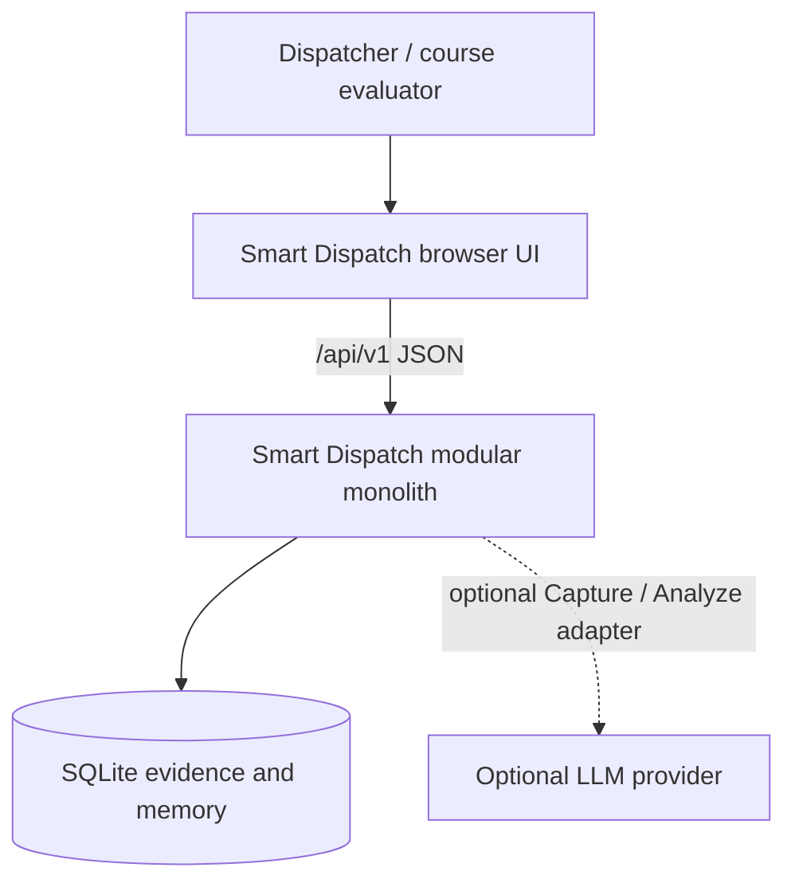
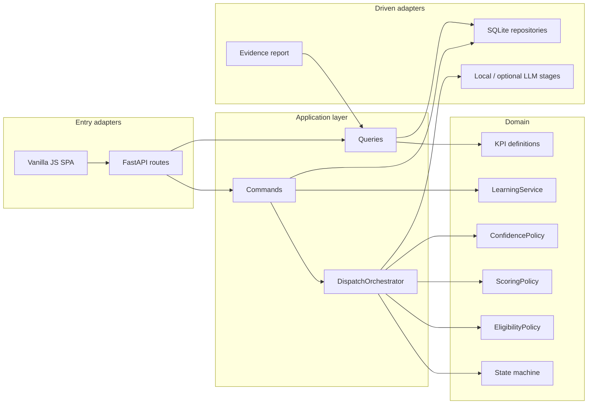
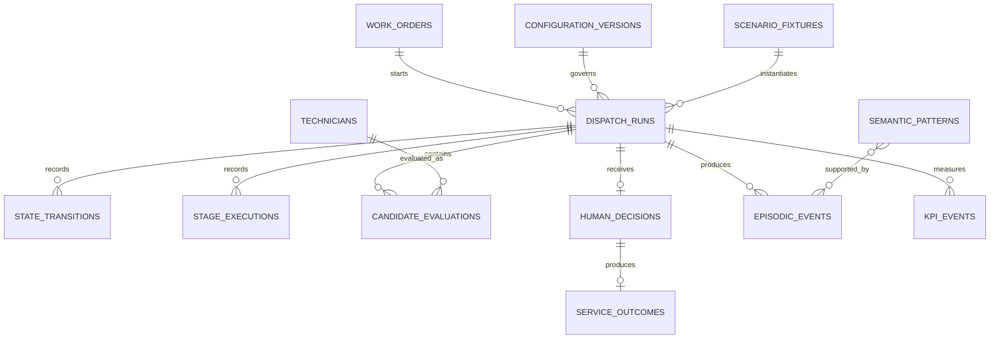
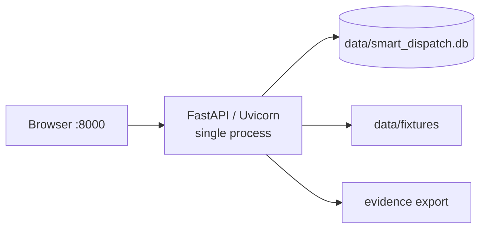

# Smart Dispatch IA v2.1 — Academic Architecture

## 1. Purpose

This document explains how Smart Dispatch IA evolves from a descriptive multi-agent prototype into a demonstrable, controlled, and testable system for a course assignment. It is written for an instructor or technical evaluator. The binding implementation contract is `ARCHITECTURE-SPINE.md`; this document explains the reasoning and delivery path.

## 2. Architectural Thesis

The system uses multiple named processing stages, but it does not allow those stages to coordinate themselves. A deterministic orchestrator controls the sequence, validates every JSON boundary, records evidence, and prevents any learned preference from bypassing safety rules.

The selected paradigm is a **hexagonal modular monolith with a deterministic pipeline**:

- **Modular monolith:** one process and one database keep the prototype understandable and deployable.
- **Hexagonal:** business rules remain independent from HTTP, SQLite, browser code, and optional model providers.
- **Deterministic pipeline:** the same snapshots and configuration produce the same eligibility, score, confidence, and KPIs.

This design keeps the educational project small while demonstrating production-grade separation of responsibilities.

## 3. Why This Stack

The existing application already uses Python and a browser-based JavaScript interface. Reusing those assets avoids an unrelated rewrite. FastAPI and Pydantic replace handwritten routing and validation; SQLAlchemy Core and Alembic provide explicit database access and migrations without hiding the data model behind a large ORM abstraction.

The versions were verified on 2026-07-27:

| Technology | Selected version | Role |
| --- | --- | --- |
| Python | 3.12.10 | Runtime with full installers available for evaluator setup |
| uv | 0.11.16 | Python provisioning and exact dependency lock |
| FastAPI | 0.138.2 | Versioned local API and OpenAPI generation |
| Uvicorn | 0.46.0 | Single-worker ASGI server |
| Pydantic | 2.13.4 | Strict request, response, and Agent Stage contracts |
| SQLAlchemy Core | 2.0.51 | Explicit SQL composition and transaction access |
| Alembic | 1.18.5 | Repeatable schema migrations |
| SQLite | Bundled with Python | Shared local operational and memory store |
| Vanilla JavaScript | ECMAScript 2023 baseline | Existing browser adapter |
| pytest | 9.1.1 | Automated tests |
| coverage.py | 7.13.5 | Test coverage evidence |
| Playwright for Python | 1.60.0 | Pinned Chrome-for-Testing browser smoke tests |

Pre-release versions were deliberately excluded. FastAPI's official documentation confirms its ASGI execution model and bundled server tooling; SQLAlchemy and Alembic official documentation confirm the selected stable lines.

## 4. System Context



The MVP runs on `127.0.0.1`. The browser and API are one deployment, and essential assets are vendored for an offline demonstration. External LLM use is optional because the course demonstration must remain reproducible without credentials or network access.

## 5. Component Model



### Responsibility boundaries

- The **HTTP adapter** validates transport-level input and maps domain errors to stable API errors.
- The **application layer** coordinates commands, transactions, and queries.
- The **orchestrator** is the only component allowed to advance a Dispatch Run.
- The **domain** owns eligibility, score, confidence, learning, and KPI definitions as deterministic logic.
- **Repositories** own database access but make no business decisions.
- The **browser** displays evidence and sends decisions; it cannot calculate authoritative results.

## 6. Deterministic Dispatch Sequence

```mermaid
sequenceDiagram
  actor D as Dispatcher
  participant UI as Browser
  participant API as API
  participant O as Orchestrator
  participant P as Domain Policies
  participant DB as SQLite

  D->>UI: Start scenario
  UI->>API: POST /api/v1/dispatch-runs
  API->>O: StartDispatch(command)
  O->>DB: Persist run snapshot and CAPTURE state
  O->>O: Capture and validate JSON
  O->>DB: Persist output and transition to ANALYZE
  O->>O: Analyze and validate JSON
  O->>P: Evaluate Hard Constraints
  P-->>O: Eligible and rejected candidates
  O->>P: Score eligible candidates
  O->>P: Calculate confidence and warnings
  O->>DB: Persist evidence and WAIT_FOR_DECISION
  O-->>API: Recommendation or NO_FEASIBLE_CANDIDATES
  API-->>UI: Structured evidence
  D->>UI: Accept / override / decline
  UI->>API: POST decision
  API->>DB: Atomic decision and evidence write
  Note over D,DB: Field service occurs; no transaction remains open
  D->>UI: Record outcome
  UI->>API: POST outcome
  API->>DB: Atomic outcome write
  API->>P: Append episode and update patterns
  P->>DB: Persist learning and COMPLETED state
```

Every stage validates input and output before transition. A validation error produces a typed failure and preserves prior evidence.

Stage responsibilities are fixed: Capture normalizes; Analyze derives requirements and provenance; Plan evaluates every Hard Constraint and then scores only eligible candidates; Evaluate verifies evidence and calculates confidence and warnings without changing eligibility or rank; Learn processes a recorded outcome.

## 7. Hard Constraints and Objective Score

Eligibility and ranking are separate phases.

1. Every Technician is evaluated for availability, all required certifications, shift, maximum workday, and enabled safety constraints.
2. Any failed Hard Constraint makes the Technician ineligible.
3. Only Eligible Candidates receive an Objective Score.
4. Semantic Patterns affect only the Memory Score Component.

The configured default score is:

`0.35 × SLA + 0.25 × proximity + 0.20 × workload_balance + 0.10 × quality + 0.10 × memory − penalties`

Each component is normalized to 0–100 and stored with raw input, weight, contribution, and configuration version. Recommendation Confidence is calculated and displayed separately.

The v1 normalization registry is deterministic:

- `SLA = clamp(100 × (1 − ETA minutes / SLA minutes))`
- `proximity = clamp(100 − 2 × distance km)`
- `workload_balance = clamp(100 × (1 − projected hours / maximum workday hours))`
- `quality = clamp(20 × rating)`; missing rating uses 50 plus a warning
- `memory = clamp(50 + Σ(confidence × signed effect points))`; no active pattern uses neutral 50
- distance beyond 50 km contributes a penalty of one point per extra kilometer, capped at 20

Confidence uses mean data quality, supporting-episode count capped at ten, the PRD score-margin rule, and a 25-point deduction per uncertain condition. All arithmetic uses decimals and is rounded only for API display.

## 8. State and Transaction Ownership

The database is the authoritative state. The orchestrator does not rely on browser variables or module-level Python lists.

Each mutating command executes within its own transaction:

- starting a run persists its snapshot and initial state;
- completing a stage persists its execution record and State Transition together;
- recording a Human Decision is atomic and leaves the run waiting for an outcome;
- recording the later service outcome is a separate atomic command that enables learning;
- learning appends episodic evidence and updates Semantic Patterns atomically.

SQLite runs with foreign keys enabled, WAL mode, and a busy timeout. The MVP permits one application process. This constraint is appropriate for a local course demonstration and avoids pretending SQLite is a distributed coordination service.

Each Dispatch Run has a revision number. Stage, decision, outcome, replay, and reset commands update by compare-and-swap; stale commands return `409 CONFLICT`. Each stage commits independently, making the pipeline crash-resumable.

After interruption, the orchestrator resumes from the last committed state. A completed stage is not recomputed. Learning uses a unique outcome/policy ledger and one transaction for episode append, Semantic Pattern update, and completion. A failure enters `LEARN_FAILED` and can be retried without double learning.

## 9. Memory Architecture

### Episodic Memory

Episodic records are immutable facts: run inputs, alternatives, recommendation, Human Decision, service result, warnings, and events. They are never rewritten to match a later conclusion.

### Semantic Patterns

Semantic Patterns are derived statistics linked to supporting episodes. The learning service is their only writer. A pattern requires the PRD's minimum evidence threshold, gains confidence with consistent evidence, loses confidence with contradictions, and decays with age.

The eligibility engine never reads Semantic Patterns. This is the architectural guarantee that learning cannot weaken safety.

## 10. Data Model



JSON snapshots are stored as versioned evidence alongside queryable columns. The migration from `learning_store.json` imports existing items as seeded assumptions; it does not invent supporting historical episodes.

Legacy identifiers such as `tech_01` remain immutable external IDs while database rows receive UUID primary keys. Naive timestamps are interpreted in `America/Argentina/Buenos_Aires`, converted to UTC, and tagged with migration provenance. Imported JSON learnings are inactive hypotheses except in explicitly named synthetic fixtures.

## 11. API Surface

Minimum local API:

| Method and path | Purpose |
| --- | --- |
| `POST /api/v1/work-orders` | Create and validate a Work Order |
| `GET /api/v1/work-orders` | List Work Orders |
| `GET /api/v1/technicians` | List Technician state |
| `POST /api/v1/dispatch-runs` | Start a Dispatch Run |
| `GET /api/v1/dispatch-runs/{run_id}` | Retrieve state and evidence |
| `POST /api/v1/dispatch-runs/{run_id}/replays` | Create a new run from the persisted source snapshot and selected Memory Experiment Mode |
| `POST /api/v1/dispatch-runs/{run_id}/decisions` | Accept, override, or decline |
| `POST /api/v1/dispatch-runs/{run_id}/outcomes` | Record service outcome |
| `POST /api/v1/scenarios/{scenario_id}/compare` | Run Memory on/off comparison |
| `GET /api/v1/kpis` | Query KPI results and definitions |
| `GET /api/v1/evidence/{run_id}` | Produce report-ready evidence |
| `GET /api/v1/semantic-patterns` | Inspect pattern status, evidence count, confidence, decay, and provenance |
| `POST /api/v1/admin/reset` | Reset seeded local demonstration data |

Mutating commands use an idempotency key. Errors have stable codes such as `VALIDATION_FAILED`, `INVALID_TRANSITION`, `NO_FEASIBLE_CANDIDATES`, `INELIGIBLE_OVERRIDE`, and `CONFLICT`.

During migration, unversioned `/api/*` routes remain thin translators over the same application use cases. They contain no business logic and are removed only after the SPA and all smoke tests use `/api/v1`.

## 12. Deployment and Operations

### Local MVP



- One process bound to `127.0.0.1`.
- Alembic migrations run before the server accepts requests.
- `pyproject.toml` and `uv.lock` provision Python 3.12.10 and the exact dependency graph.
- `.python-version` pins the runtime; `uv sync --frozen` installs it; `uv run smart-dispatch` migrates fail-closed and starts one Uvicorn worker.
- The application records the runtime SQLite version and refuses startup below SQLite 3.35.0.
- Database backup/export uses SQLite's backup API.
- A backup is taken before schema-changing migration and destructive reset; migration failure stops startup without recreating the database.
- Structured logs omit raw addresses and exact GPS coordinates.
- Reset is an explicit admin command and recreates seeded state transactionally.
- Reset rejects active runs, creates a backup, clears runtime/evidence/idempotency/learning tables, reloads the selected fixture, and preserves exported reports.

### Before any external pilot

Authentication, authorization, HTTPS termination, retention/deletion policy, secrets, multi-user concurrency, and a database/platform review become mandatory. They are intentionally not simulated as “production ready” in the MVP.

## 13. Testing and Academic Evidence

| Layer | Evidence |
| --- | --- |
| Domain unit tests | Every Hard Constraint, score component, confidence factor, tie-break, learning threshold, contradiction, and decay rule |
| Repository integration tests | Migrations, foreign keys, transaction rollback, idempotency, snapshot retrieval |
| API contract tests | Pydantic/OpenAPI schemas, error envelopes, invalid transitions, no feasible candidate |
| Browser smoke tests | UJ-1, UJ-2, UJ-3; keyboard-only operation, visible focus, semantic labels, non-color status text, and applicable WCAG 2.2 AA criteria |
| Scenario tests | stale/offline data, close scores, Memory on/off, single versus repeated evidence |
| Benchmark | p95 below 3 seconds across 100 warm deterministic runs with up to 100 Technicians and 100 open Work Orders; exclude UI animation and optional LLM latency; record hardware and runtime |

The academic report must identify run IDs, fixture/configuration versions, results, KPI definitions, Memory comparison, synthetic-data limitations, rejected alternatives, and known risks.

### Acceptance registry

- SM-1–SM-4 require 100% invariant conformance across the automated scenario suite.
- A seeded case must show high Objective Score with low Recommendation Confidence.
- One episode must not promote a Semantic Pattern; repeated consistent evidence must.
- Memory on/off evidence must include one changed Eligible Candidate order and one unchanged order, with identical Hard Constraint results.
- KPI-1–KPI-8 use the exact PRD §11 numerator, denominator, exclusion, unit, window, and unavailable-value rules.
- Every selected academic scenario must resolve from report result to configuration, fixture, Dispatch Run, stage evidence, and decision/outcome evidence.

## 14. Brownfield Migration

1. Freeze existing behavior with characterization tests and fix the `alerts.push` runtime defect.
2. Add Python 3.12.10 provisioning, `pyproject.toml`, `uv.lock`, package structure, Pydantic contracts, and FastAPI while retaining the SPA.
3. Create SQLite schema and Alembic migration; import seed technicians, orders, and JSON learning assumptions.
4. Move hard constraints into `EligibilityPolicy`.
5. Move score and confidence into deterministic domain policies.
6. Add the orchestrator and persisted State Transitions.
7. Add Human Decision, outcome, episodic, and Semantic Pattern flows.
8. Migrate the SPA to `/api/v1` evidence resources.
9. Add KPI, comparison, and academic evidence endpoints.
10. Remove the compatibility launcher after all tests and journeys pass.

Each step leaves a runnable system; the migration does not require a single risky rewrite.

Legacy routes stay as compatibility adapters until UJ-1–UJ-3 plus no-feasible, retry, reset, and error flows pass through `/api/v1`. The browser uses `textContent` for untrusted values and vendored assets so the demonstration remains safe and offline.

## 15. Alternatives Considered

### Keep `http.server`

Rejected because handwritten routing and validation would duplicate infrastructure work and make the JSON contract harder to enforce.

### Convert to Node/Express and React

Rejected because those technologies exist only in older descriptive documents, not the brownfield implementation. A rewrite would add course risk without improving the core learning objective.

### Microservices

Rejected because the project has one operator, one local database, and one deployment. Distributed failure modes would obscure the dispatch logic.

### Autonomous agent coordination

Rejected because independent agents could bypass ordering and Hard Constraints. The orchestrator remains authoritative.

### Fine-tuning or vector memory

Rejected for the MVP. Incremental statistics are reproducible, inspectable, and aligned with the professor feedback.

### PostgreSQL

Deferred until multi-user or external deployment needs exceed SQLite's single-process operating envelope.

## 16. Assumptions, Limits, and Revisit Conditions

- The MVP is local, single-user, and single-process.
- Exact customer addresses and GPS are never written to structured logs or Semantic Patterns.
- The current Spanish UI may remain Spanish; contracts and academic artifacts are in English.
- External LLM use is optional and must not affect the deterministic baseline.
- Data retention and deletion must be decided before an external pilot.
- Authentication and HTTPS topology must be designed before non-local use.

## 17. Legacy Rule Disposition

| Existing rule | MVP disposition |
| --- | --- |
| Availability | Hard Constraint |
| All required certifications | Hard Constraint |
| Shift and maximum workday | Hard Constraint |
| Four-hour accumulated driving limit | Hard Constraint |
| Required EPP for priority 4–5 | Hard Constraint |
| Priority-5 overtime exception | Superseded by professor feedback |
| 50 km radius | Soft penalty; does not exclude the only certified otherwise-eligible Technician |
| Override to ineligible Technician | Rejected; no MVP exception path |

## 18. Traceability

The Architecture Spine maps every PRD feature area to its owning module and Architecture Decision. Epics and stories must cite the relevant `AD-n` identifiers; a story may add local detail but may not weaken an AD.

The exact score, confidence, freshness, learning, tie-break, KPI, warning, accessibility, and benchmark defaults are incorporated from PRD §§4, 5, 9, 11, and 13 as contract/configuration version `v1`. Their `[ASSUMPTION]` status remains visible until course validation confirms them.

## 19. Technology Verification Sources

- [Python 3.12.10 release](https://www.python.org/downloads/release/python-31210/)
- [uv project management](https://docs.astral.sh/uv/guides/projects/)
- [FastAPI release notes](https://fastapi.tiangolo.com/release-notes/)
- [FastAPI deployment model](https://fastapi.tiangolo.com/deployment/manually/)
- [Pydantic releases](https://github.com/pydantic/pydantic/releases)
- [SQLAlchemy 2.0 documentation](https://docs.sqlalchemy.org/en/20/)
- [Alembic documentation](https://alembic.sqlalchemy.org/en/latest/)
- [pytest release announcements](https://docs.pytest.org/en/stable/announce/index.html)
- [coverage.py change history](https://coverage.readthedocs.io/en/7.13.5/changes.html)
- [Uvicorn release notes](https://www.uvicorn.org/release-notes/)
- [Playwright for Python releases](https://github.com/microsoft/playwright-python/releases)
