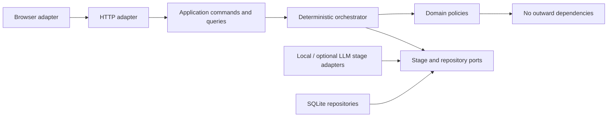
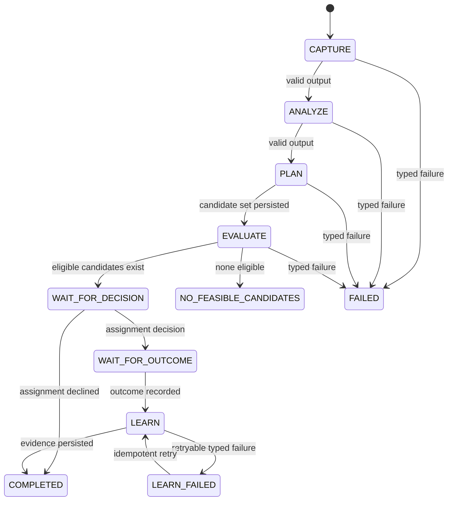
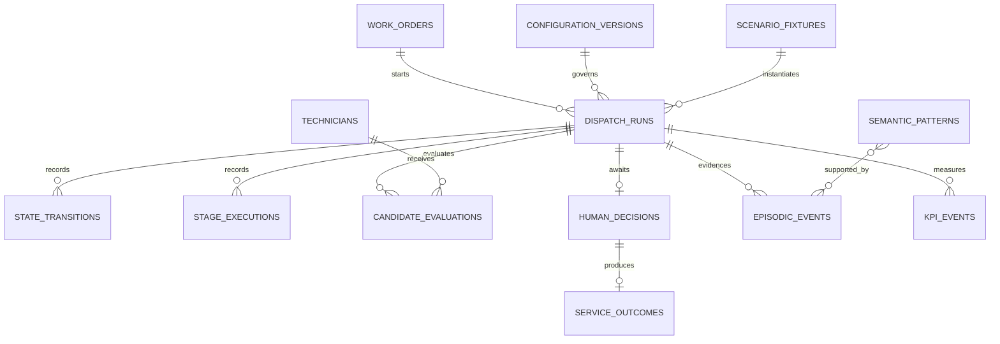

# Architecture Spine — Smart Dispatch IA v2.1

## Design Paradigm

**Hexagonal modular monolith with a deterministic pipeline.**



Dependencies point inward. Domain modules import neither FastAPI, SQLAlchemy, SQLite, browser code, nor model-provider SDKs.

## Invariants & Rules

### AD-1 — Hexagonal modular monolith

- **Binds:** all
- **Prevents:** HTTP handlers, persistence, UI, or provider adapters becoming alternate owners of business decisions.
- **Rule:** All entry adapters call application use cases through typed commands or queries; application code invokes domain policies and ports; adapters implement ports and never become dependencies of the domain.

### AD-2 — Orchestrator owns State Transitions

- **Binds:** FR-1–FR-3, FR-20, NFR-2, NFR-7
- **Prevents:** Agent Stages skipping, repeating, or inventing State Transitions.
- **Rule:** Only `DispatchOrchestrator` may advance a Dispatch Run using the versioned transition table; each transition and stage execution is persisted before the next stage begins.



### AD-3 — Feasibility precedes ranking

- **Binds:** FR-6–FR-12, SM-1, SM-4, SM-C2
- **Prevents:** Memory, priority, score, or UI overrides making an ineligible Technician rankable.
- **Rule:** `EligibilityPolicy` evaluates every enabled Hard Constraint and persists all results; only candidates with every check equal to `pass` may enter `ScoringPolicy`.

### AD-4 — Score and confidence are pure calculations

- **Binds:** FR-10–FR-14, NFR-2, SM-2, SM-6
- **Prevents:** hidden I/O, mutable global state, rounding drift, or conflation of Objective Score and Recommendation Confidence.
- **Rule:** `ScoringPolicy` and `ConfidencePolicy` accept immutable run snapshots plus a versioned configuration and return immutable results; round only at the API presentation boundary using decimal half-up to two places.

### AD-5 — One transaction per command

- **Binds:** FR-1–FR-3, FR-15–FR-21, NFR-3, NFR-7
- **Prevents:** partial advancement of a Dispatch Run or evidence that disagrees with operational state.
- **Rule:** Each mutating application command executes through one `UnitOfWork`; repositories may not commit independently, and command failure rolls back every write from that command.

### AD-6 — Episodic evidence and Semantic Patterns are separate

- **Binds:** FR-16–FR-19, SM-4, SM-7, SM-9
- **Prevents:** overwriting evidence, activating a rule from one observation, or Memory mutating eligibility.
- **Rule:** Episodic records are append-only; only `LearningService` writes Semantic Patterns from linked episodes; scoring reads active Semantic Patterns, while eligibility reads none.

### AD-7 — Pydantic contracts at every boundary

- **Binds:** FR-1–FR-5, FR-20, NFR-7
- **Prevents:** independently built Agent Stages or API endpoints disagreeing on JSON shape.
- **Rule:** Each API and Agent Stage boundary uses a versioned Pydantic request/output model with forbidden unknown fields; invalid output becomes a persisted typed failure and cannot trigger a State Transition.

### AD-8 — Versioned, idempotent local API

- **Binds:** FR-4, FR-15, FR-18–FR-20
- **Prevents:** incompatible response envelopes and duplicate decisions/outcomes caused by retries.
- **Rule:** Routes live under `/api/v1`; mutating run, decision, outcome, replay, and reset commands require `Idempotency-Key`; all responses use the common success/error envelope and stable error codes.

### AD-9 — Browser is a replaceable adapter

- **Binds:** UJ-1–UJ-3, FR-12–FR-20, NFR-6
- **Prevents:** DOM state or animation timing becoming authoritative domain state.
- **Rule:** The vanilla JavaScript SPA renders API resources and submits commands only; it never calculates eligibility, score, confidence, learning, or KPIs.

### AD-10 — One immutable run snapshot

- **Binds:** FR-8, FR-10–FR-14, FR-19, NFR-2, NFR-7
- **Prevents:** changing time, Technician state, environment data, or configuration during a run.
- **Rule:** Run creation captures UTC clock, Work Order, Technician roster, environment, data freshness, and configuration version; every stage reads that snapshot.

### AD-11 — Evidence, not chain-of-thought

- **Binds:** FR-2, FR-12–FR-14, FR-21, NFR-4
- **Prevents:** explainability depending on private or provider-specific reasoning text.
- **Rule:** Persist and expose structured inputs, checks, contributions, warnings, outputs, and concise explanation templates; never store or render private chain-of-thought.

### AD-12 — Local deterministic stages are the MVP baseline

- **Binds:** FR-4–FR-5, NFR-1, NFR-2
- **Prevents:** external model availability, cost, or nondeterminism blocking the academic demonstration.
- **Rule:** Capture and Analyze ports default to deterministic local adapters; an optional LLM adapter may replace them only if it returns the same contract and passes validation, with provider/model metadata recorded.

### AD-13 — Single-process SQLite operating envelope

- **Binds:** FR-16–FR-21, NFR-1, NFR-3, NFR-5, NFR-7
- **Prevents:** unsupported concurrent writers, undeclared infrastructure, and unrecoverable local evidence.
- **Rule:** MVP runs as one FastAPI process against `data/smart_dispatch.db`; SQLite uses foreign keys, WAL mode, and busy timeout; Alembic migrations run before serving; export/backup copies the database through SQLite's backup API.

### AD-14 — Comparable scenarios share fixtures

- **Binds:** FR-18–FR-21, SM-4, SM-5, SM-9, SM-10
- **Prevents:** Memory on/off or KPI comparisons using different operational inputs.
- **Rule:** A Scenario Fixture identifies immutable Work Order, Technician, environment, clock, and non-memory configuration snapshots; comparison runs differ only by Memory Experiment Mode.

### AD-15 — Tests mirror architecture boundaries

- **Binds:** all FRs, all NFRs, all SMs
- **Prevents:** a successful manual demo masking violated invariants.
- **Rule:** Domain policies require pure unit tests; repositories require real-SQLite integration tests; `/api/v1` requires contract tests; UJ-1–UJ-3 require browser smoke tests; every defect fix adds a failing regression test first.

### AD-16 — PRD behavioral registry is binding

- **Binds:** FR-2–FR-19, NFR-1, NFR-6, SM-1–SM-10
- **Prevents:** independent implementations choosing different formulas, thresholds, evidence fields, KPI semantics, accessibility scope, or performance acceptance.
- **Rule:** PRD §§4, 5, 9, 11, and 13 are incorporated as configuration/contract version `v1`; persisted/API evidence must include every required field and preserve its `[ASSUMPTION]` markers until approved. `NO_FEASIBLE_CANDIDATES` has no recommendation; every Technician has eligibility evidence; only eligible candidates have scores; warnings include source, quality, freshness, fallback, and impact.

### AD-17 — Decision and outcome are separate atomic commands

- **Binds:** FR-15–FR-17, NFR-3
- **Prevents:** holding a transaction open across field service or learning before an outcome exists.
- **Rule:** `RecordDecision` atomically persists the Human Decision and decision-time evidence, leaving the run `WAIT_FOR_OUTCOME`; later `RecordOutcome` atomically appends the Service Outcome and advances to `LEARN`. A seeded scenario may call both commands sequentially but may not merge their transactions.

### AD-18 — Stage semantics are fixed

- **Binds:** FR-1–FR-14
- **Prevents:** PLAN ranking before eligibility or EVALUATE changing eligibility or rank.
- **Rule:** `CAPTURE` normalizes input; `ANALYZE` derives requirements and provenance; `PLAN` runs every Hard Constraint then scores only eligible candidates; `EVALUATE` verifies evidence, calculates confidence/warnings, and renders explanation without changing eligibility or rank; `LEARN` runs only after an outcome.

### AD-19 — Legacy API is a temporary compatibility adapter

- **Binds:** brownfield migration, UJ-1–UJ-3
- **Prevents:** breaking the working SPA or duplicating business logic during `/api/v1` cutover.
- **Rule:** Existing `/api/*` routes delegate to the same application use cases and translate envelopes only; remove them and `server.py` only after all journey and error smoke tests pass exclusively through `/api/v1`.

### AD-20 — Stage commits use optimistic concurrency

- **Binds:** FR-1–FR-3, FR-15–FR-20, NFR-3, NFR-7
- **Prevents:** duplicate transitions, lost updates, and ambiguity between durable evidence and command rollback.
- **Rule:** Each stage advancement is an internal command with its own transaction and compare-and-swap on `dispatch_runs.revision`; decision, outcome, replay, and reset use revision/uniqueness guards; stale writes return `409 CONFLICT`.

### AD-21 — Migration preserves identity and provenance

- **Binds:** FR-16–FR-21, NFR-2, NFR-7
- **Prevents:** orphaned JSON references, timestamp shifts, duplicate imports, and synthetic assumptions presented as observed learning.
- **Rule:** Retain legacy string IDs as immutable external IDs beside UUID primary keys; convert naive timestamps from `America/Argentina/Buenos_Aires` to UTC with provenance; fixture IDs/timestamps are deterministic; imported JSON learnings are inactive hypotheses except inside named synthetic fixtures.

### AD-22 — Local serving and data safety

- **Binds:** NFR-3, NFR-5, NFR-6, brownfield migration
- **Prevents:** accidental LAN exposure, network-dependent demo assets, DOM injection, and destructive migration/reset loss.
- **Rule:** Bind `127.0.0.1` by default; FastAPI serves vendored assets same-origin; browser inserts untrusted values with `textContent`; schema-changing migration and reset create a SQLite backup; migration failure is fail-closed; non-loopback binding requires the deferred security design.

### AD-23 — Legacy business-rule disposition

- **Binds:** FR-6–FR-9, FR-15, SM-1, SM-C2
- **Prevents:** older specifications restoring exceptions or turning safety rules into optional defaults.
- **Rule:** Availability, all certifications, shift, maximum workday, four-hour driving limit, and required EPP are Hard Constraints; the priority-5 overtime exception is superseded; the 50 km radius never changes eligibility and always applies the AD-24 soft penalty, including when the only certified eligible Technician is farther; ineligible overrides are rejected.

### AD-24 — Calculation registry v1 is normative

- **Binds:** FR-10–FR-14, FR-17–FR-19, SM-2, SM-4, SM-6, SM-9
- **Prevents:** conforming implementations producing different ranks, confidence, or Memory comparisons.
- **Rule:** Before final clamping, all calculations use decimal arithmetic: `SLA = clamp(100 × (1 − eta_minutes / sla_minutes))`; `proximity = clamp(100 − 2 × distance_km)`; `workload_balance = clamp(100 × (1 − projected_work_hours / max_workday_hours))`; `quality = clamp(20 × rating_0_to_5)` or 50 with a warning; `memory = clamp(50 + Σ(confidence × signed_effect_points))` or neutral 50; `distance_penalty = min(20, max(0, distance_km − 50))`; other penalties must be named/versioned and default to zero. Confidence factors are `data_quality = mean(source_quality)` where current/stale/unavailable equal 100/75/50, `historical_evidence = min(100, 10 × active_supporting_episode_count)`, PRD score-margin v1, and `condition_certainty = clamp(100 − 25 × uncertain_condition_count)`. `clamp(x)=min(100,max(0,x))`; final score follows PRD FR-11 and tie-break follows PRD FR-12.

### AD-25 — Recovery and exactly-once learning protocol

- **Binds:** FR-1–FR-3, FR-16–FR-17, NFR-3, NFR-7
- **Prevents:** crash ambiguity, duplicate episodes, or repeated Semantic Pattern updates.
- **Rule:** A run resumes from its last committed state; `(run_id,state,attempt)` and `(outcome_id,learning_policy_version)` are unique; a committed stage is never recomputed during resume; `LEARN` applies episode append, pattern-update ledger, and transition in one transaction; failure enters retryable `LEARN_FAILED` without losing outcome evidence.

### AD-26 — Reproducible runtime and launch contract

- **Binds:** all implementation units, NFR-1, AD-13, AD-15
- **Prevents:** evaluator setup drift, multi-worker SQLite use, and tests targeting an unspecified browser.
- **Rule:** `.python-version` pins Python 3.12.10; `pyproject.toml` plus `uv.lock` is authoritative; `uv sync --frozen` provisions dependencies; `uv run smart-dispatch` runs a launcher that migrates fail-closed then starts Uvicorn on `127.0.0.1:8000` with one worker; browser tests use Playwright's pinned Chrome-for-Testing build. Patch updates require green unit/integration/contract/browser suites and an updated lock.

### AD-27 — Snapshot, API, KPI, replay, and reset ownership

- **Binds:** FR-2, FR-10–FR-21, NFR-2, NFR-7
- **Prevents:** calculation from mutable rows, incompatible endpoints, KPI recomputation drift, cross-run Memory contamination, or ambiguous destructive reset.
- **Rule:** `run_snapshots` owns immutable copied JSON used by every calculation; generated OpenAPI from `contracts/` owns `/api/v1` operations and schemas; `kpi_events` plus configuration version own KPI results; replay creates a new run with `source_run_id` and an isolated Memory read snapshot; reset rejects active runs, backs up the DB, clears operational/evidence/idempotency/learning tables, reloads the selected fixture transactionally, and never deletes exported reports.

## Consistency Conventions

| Concern | Convention |
| --- | --- |
| Python packages and files | `snake_case`; one bounded module per package |
| Domain types | singular `PascalCase`; IDs are opaque UUID strings |
| API JSON | `snake_case`; ISO 8601 UTC timestamps ending in `Z`; decimal scores serialized as numbers |
| API success | `{"data": ..., "meta": {"schema_version": "v1", "request_id": "..."}}` |
| API error | `{"error": {"code": "...", "message": "...", "details": [...]}, "meta": {...}}`; `NO_FEASIBLE_CANDIDATES` carries no recommendation |
| Commands and events | imperative command names; past-tense event names |
| Database | plural `snake_case` tables; explicit foreign keys; UTC text timestamps |
| Configuration | immutable versioned rows; environment variables select paths/secrets only |
| Logging | structured JSON with `request_id`, `run_id`, `stage`, `duration_ms`, `status`; no raw address or exact GPS |
| Mutation | commands through `UnitOfWork`; queries are side-effect free |
| Errors | domain errors map once at the HTTP adapter; no swallowed exceptions |
| Evidence contracts | `WorkOrder` retains raw input plus field provenance; `StageExecution` retains start/end/duration/status/schema/input/output/error; snapshots are retrievable and location-redacted |
| Accessibility | PRD NFR-6 applies to all named MVP flows and remains a WCAG 2.2 AA assumption until approved |
| Idempotency | every external mutating command; key + route scope; same key/different request hash is `409`; response retained for the evidence window |
| Request safety | JSON only for API commands; 1 MiB body limit; stable `413`, `415`, and `422` errors |

## Stack

| Name | Version |
| --- | --- |
| Python | 3.12.10 |
| uv | 0.11.16 |
| FastAPI | 0.138.2 |
| Pydantic | 2.13.4 |
| SQLAlchemy Core | 2.0.51 |
| Alembic | 1.18.5 |
| SQLite | CPython 3.12.10 bundled version |
| SQLite capability floor | 3.35.0 |
| Uvicorn | 0.46.0 |
| Vanilla HTML/CSS/JavaScript | ECMAScript 2023 baseline |
| pytest | 9.1.1 |
| coverage.py | 7.13.5 |
| Playwright for Python | 1.60.0 |

## Structural Seed

```text
smart-dispatch-ia-spec-v2/
  app/
    main.py                 # FastAPI composition root
    api/v1/                # HTTP routes and envelopes
    application/           # commands, queries, orchestrator, unit-of-work ports
    domain/
      dispatch/            # state machine and run model
      eligibility/         # hard constraints
      scoring/             # objective and confidence policies
      learning/            # episodic aggregation and semantic promotion
      metrics/             # KPI definitions
    contracts/             # Pydantic API and stage models
    adapters/
      stages/              # deterministic and optional LLM adapters
      persistence/         # SQLAlchemy Core repositories and unit of work
    migrations/            # Alembic revisions
  frontend/                # existing SPA, migrated to /api/v1
  data/
    smart_dispatch.db      # ignored runtime database
    fixtures/              # versioned academic scenarios
  tests/
    unit/
    integration/
    contract/
    browser/
  server.py                # temporary compatibility launcher, then removed
  pyproject.toml           # direct dependency and runtime declaration
  uv.lock                  # exact reproducible dependency graph
```



## Capability → Architecture Map

| Capability / Area | Lives in | Governed by |
| --- | --- | --- |
| Orchestration and errors, FR-1–FR-3 | `application/orchestrator`, `domain/dispatch` | AD-2, AD-5, AD-7, AD-10, AD-16, AD-18, AD-20 |
| Capture and analysis, FR-4–FR-5 | `adapters/stages`, `contracts/stages` | AD-7, AD-12 |
| Hard Constraints, FR-6–FR-9 | `domain/eligibility` | AD-3, AD-4, AD-23 |
| Ranking, FR-10–FR-12 | `domain/scoring` | AD-4, AD-10 |
| Confidence and warnings, FR-13–FR-14 | `domain/scoring` | AD-4, AD-10 |
| Human Decision and learning, FR-15–FR-17 | `application/commands`, `domain/learning` | AD-5, AD-6, AD-17 |
| KPIs and comparison, FR-18–FR-19 | `domain/metrics`, `application/queries` | AD-6, AD-14 |
| Simulation API, FR-20 | `api/v1`, `application` | AD-7, AD-8 |
| Academic evidence, FR-21 | `application/queries`, report adapter | AD-11, AD-14 |
| Browser flows and accessibility | `frontend` | AD-9, AD-19, AD-22 |
| Persistence and audit | `adapters/persistence` | AD-5, AD-6, AD-13, AD-20, AD-21 |
| Test strategy | `tests` | AD-15, AD-16, AD-26 |

## Deferred

- External LLM provider selection and prompt implementation — revisit only after deterministic UJ-1–UJ-3 pass.
- Authentication, authorization, HTTPS termination, and secret management — required before non-local use.
- Multi-process or multi-user deployment and replacement of SQLite — required before an external pilot.
- Retention, deletion, and data-subject workflows — required before real customer or Technician data.
- Real GPS, traffic, weather, routing, ERP, CRM, and ticketing integrations — outside MVP.
- Frontend framework migration — current adapter is sufficient; revisit only if UI complexity blocks delivery.
- Public API compatibility and deprecation policy — `/api/v1` is a local prototype surface.
- Internationalization beyond preserving the current Spanish UI — revisit after course delivery.
