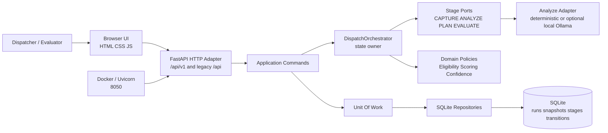
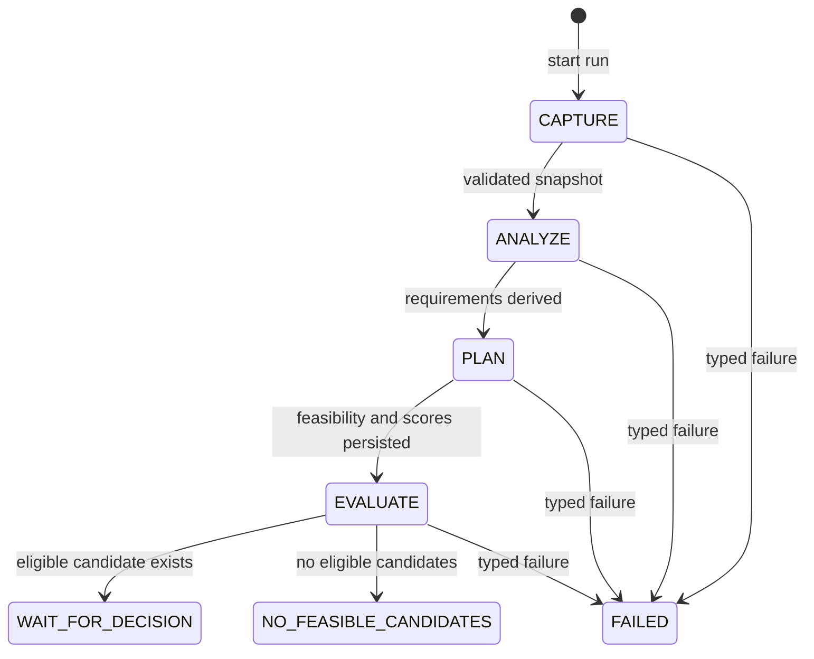
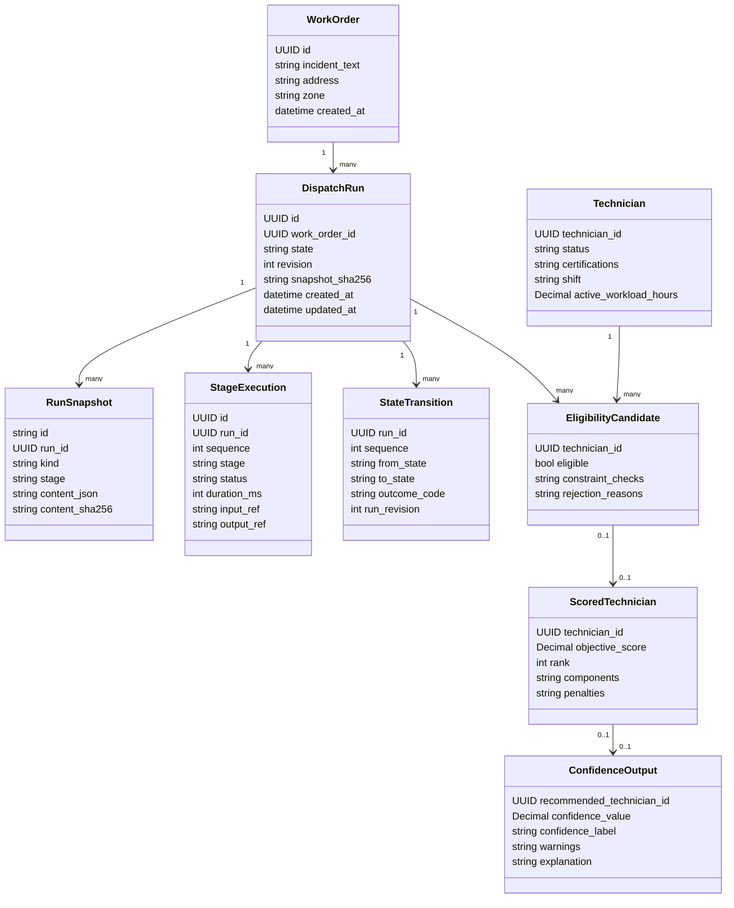
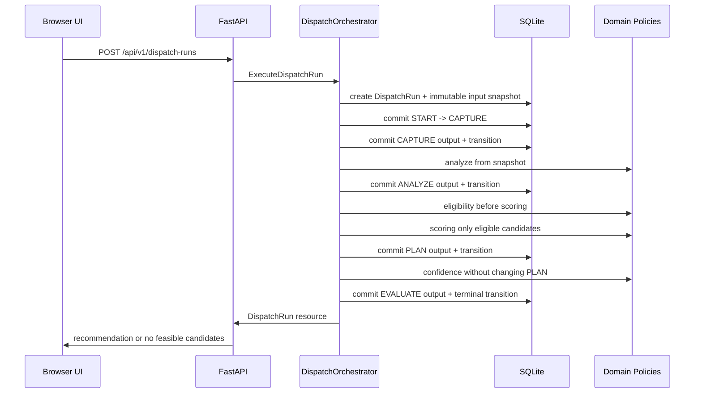

# Final Architecture Diagrams

## Architecture Diagram

```mermaid
flowchart LR
  User["Dispatcher / Evaluator"] --> Browser["Browser UI<br/>HTML CSS JS"]
  Browser --> API["FastAPI HTTP Adapter<br/>/api/v1 and legacy /api"]
  API --> Commands["Application Commands"]
  Commands --> Orchestrator["DispatchOrchestrator<br/>state owner"]
  Orchestrator --> Stages["Stage Ports<br/>CAPTURE ANALYZE PLAN EVALUATE"]
  Stages --> Analyze["Analyze Adapter<br/>deterministic or optional local Ollama"]
  Orchestrator --> Policies["Domain Policies<br/>Eligibility Scoring Confidence"]
  Commands --> UOW["Unit Of Work"]
  UOW --> Repos["SQLite Repositories"]
  Repos --> DB[("SQLite<br/>runs snapshots stages transitions")]
  Runtime["Docker / Uvicorn<br/>8050"] --> API
```

## Dispatch State Machine

```mermaid
stateDiagram-v2
  [*] --> CAPTURE: start run
  CAPTURE --> ANALYZE: validated snapshot
  ANALYZE --> PLAN: requirements derived
  PLAN --> EVALUATE: feasibility and scores persisted
  EVALUATE --> WAIT_FOR_DECISION: eligible candidate exists
  EVALUATE --> NO_FEASIBLE_CANDIDATES: no eligible candidates
  CAPTURE --> FAILED: typed failure
  ANALYZE --> FAILED: typed failure
  PLAN --> FAILED: typed failure
  EVALUATE --> FAILED: typed failure
```

## UML Class Diagram

```mermaid
classDiagram
  class WorkOrder {
    UUID id
    string incident_text
    string address
    string zone
    datetime created_at
  }

  class DispatchRun {
    UUID id
    UUID work_order_id
    string state
    int revision
    string snapshot_sha256
    datetime created_at
    datetime updated_at
  }

  class RunSnapshot {
    string id
    UUID run_id
    string kind
    string stage
    string content_json
    string content_sha256
  }

  class StageExecution {
    UUID id
    UUID run_id
    int sequence
    string stage
    string status
    int duration_ms
    string input_ref
    string output_ref
  }

  class StateTransition {
    UUID run_id
    int sequence
    string from_state
    string to_state
    string outcome_code
    int run_revision
  }

  class Technician {
    UUID technician_id
    string status
    string certifications
    string shift
    Decimal active_workload_hours
  }

  class EligibilityCandidate {
    UUID technician_id
    bool eligible
    string constraint_checks
    string rejection_reasons
  }

  class ScoredTechnician {
    UUID technician_id
    Decimal objective_score
    int rank
    string components
    string penalties
  }

  class ConfidenceOutput {
    UUID recommended_technician_id
    Decimal confidence_value
    string confidence_label
    string warnings
    string explanation
  }

  WorkOrder "1" --> "many" DispatchRun
  DispatchRun "1" --> "many" RunSnapshot
  DispatchRun "1" --> "many" StageExecution
  DispatchRun "1" --> "many" StateTransition
  DispatchRun "1" --> "many" EligibilityCandidate
  EligibilityCandidate "0..1" --> "0..1" ScoredTechnician
  ScoredTechnician "0..1" --> "0..1" ConfidenceOutput
  Technician "1" --> "many" EligibilityCandidate
```

## Data And Evidence Flow

```mermaid
sequenceDiagram
  participant UI as Browser UI
  participant API as FastAPI
  participant OR as DispatchOrchestrator
  participant DB as SQLite
  participant POL as Domain Policies

  UI->>API: POST /api/v1/dispatch-runs
  API->>OR: ExecuteDispatchRun
  OR->>DB: create DispatchRun + immutable input snapshot
  OR->>DB: commit START -> CAPTURE
  OR->>DB: commit CAPTURE output + transition
  OR->>POL: analyze from snapshot
  OR->>DB: commit ANALYZE output + transition
  OR->>POL: eligibility before scoring
  OR->>POL: scoring only eligible candidates
  OR->>DB: commit PLAN output + transition
  OR->>POL: confidence without changing PLAN
  OR->>DB: commit EVALUATE output + terminal transition
  OR->>API: DispatchRun resource
  API->>UI: recommendation or no feasible candidates
```
