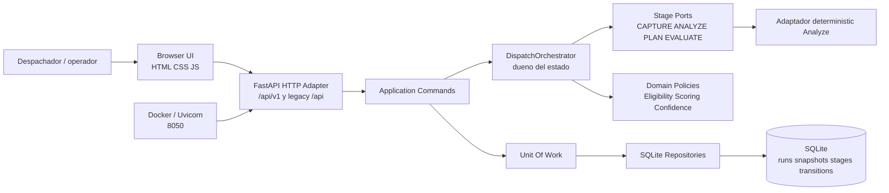
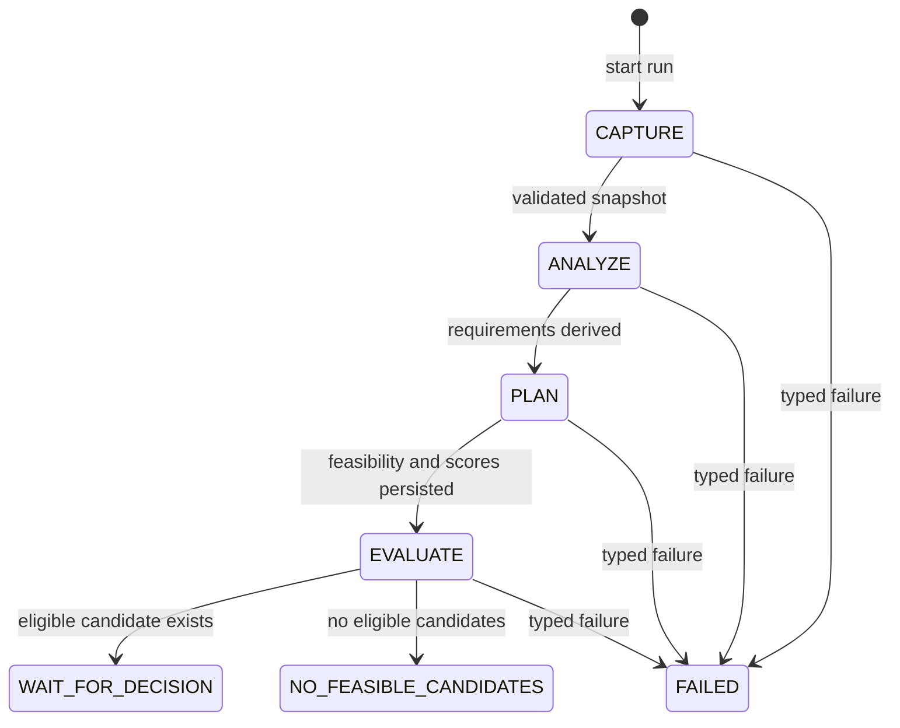
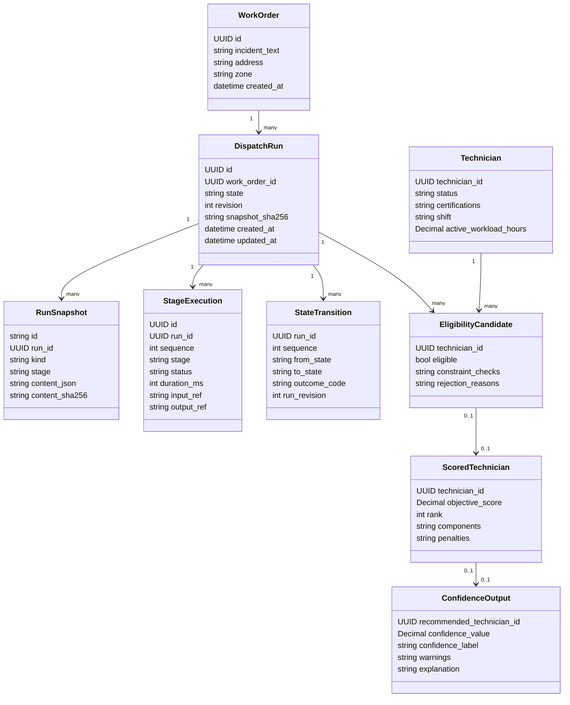
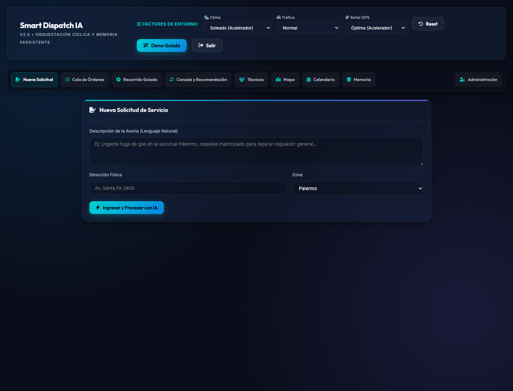
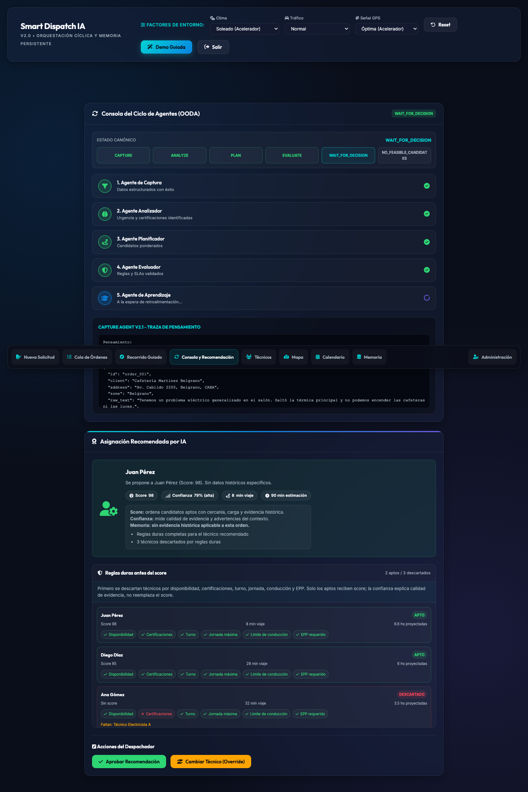
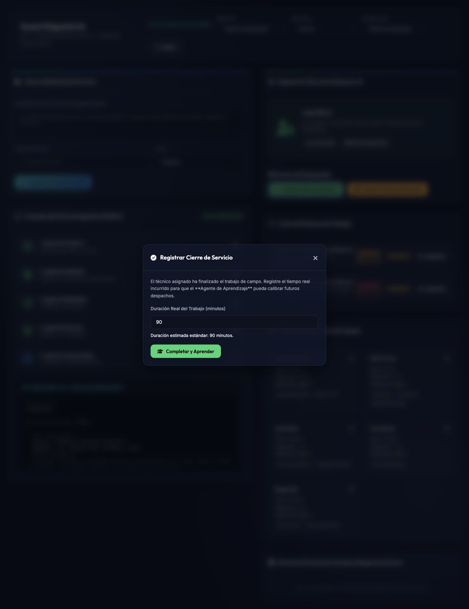
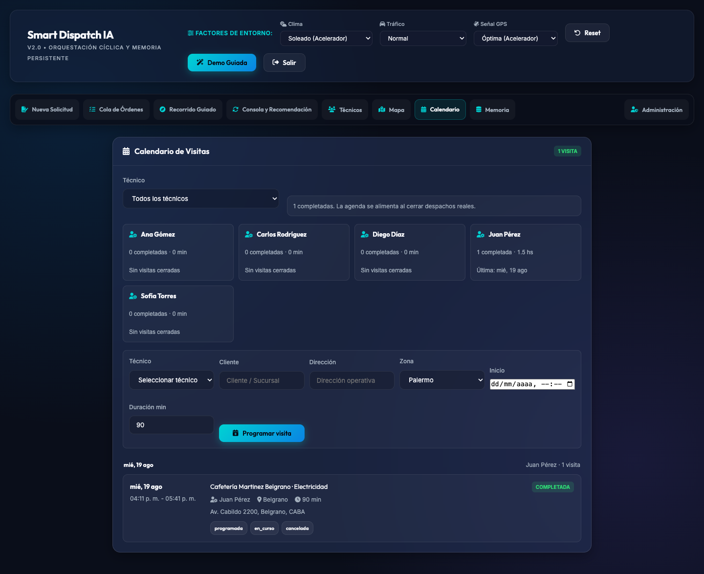

# Smart Dispatch IA - Informe Final En Markdown

## Primera pagina: links directos del proyecto

| Recurso | Link |
| --- | --- |
| Aplicacion en vivo | <https://smart-dispatch-q4xk.onrender.com> |
| Repositorio GitHub | <https://github.com/rossanny25/smart-dispatch> |
| Demo local Docker | <http://127.0.0.1:8050> |
| Acceso demo | Usuario `admin` / clave `smart2026AI` |
| Guia de ejecucion | [docs/runbook.md](./runbook.md) |
| Evidencia de sesion | [docs/usage-session-log.md](./usage-session-log.md) |

Nota: la aplicacion publicada usa Render Free. Si la instancia estuvo inactiva, la primera carga puede demorar cerca de 50 segundos o mas mientras el servicio despierta.

## Checklist de validacion

| Requisito del proyecto | Estado | Evidencia |
| --- | --- | --- |
| Aplicacion real funcionando | Cumplido | Demo en Render y Docker local |
| Link vivo en la primera pagina | Cumplido | Tabla inicial |
| Link de repositorio GitHub | Cumplido | Tabla inicial |
| Arquitectura | Cumplido | Diagramas Mermaid en este informe |
| UML | Cumplido | Diagrama de clases |
| Tecnologias con justificacion | Cumplido | Seccion 7 |
| Capturas del frontend | Cumplido | Seccion 9 |
| Log de sesion real | Cumplido | Seccion 10 |
| UX/UI con Nielsen | Cumplido | Seccion 11 |
| Log de ciberseguridad | Cumplido | Seccion 12 |
| Uso de IA en co-work | Cumplido | Seccion 13 |
| Reflexion LLM/SLM local | Cumplido | Seccion 14 |

## 1. Resumen ejecutivo

Smart Dispatch IA es un prototipo funcional de asistencia al despacho tecnico en servicios de campo. El proyecto convierte un modelo conceptual de orquestacion agentica y memoria persistente en una aplicacion web publicada, ejecutable con Docker y documentada con evidencia tecnica reproducible.

El sistema ayuda a decidir que tecnico conviene asignar a una orden de trabajo. Para hacerlo, separa el problema en etapas: captura de informacion, analisis de requerimientos, planificacion, evaluacion de restricciones, scoring, confianza y aprendizaje. La aplicacion no reemplaza al despachador: funciona como soporte a la decision y conserva evidencia de por que se recomienda un tecnico.

La evolucion principal frente al trabajo teorico inicial es que la orquestacion deja de ser una descripcion general y pasa a estar formalizada como una maquina de estados deterministica. Las reglas duras se aplican antes del ranking, la funcion objetivo esta versionada, la confianza se calcula separada del puntaje y la memoria persistente queda tratada como evidencia controlada.

## 2. Contexto y problema

En operaciones de campo, un despachador suele asignar tecnicos con informacion incompleta: tipo de incidente, zona, urgencia, habilidades requeridas, disponibilidad, carga de trabajo, distancia, clima, trafico y experiencia historica. Una mala asignacion puede causar demoras, incumplimiento de SLA, sobrecarga de tecnicos o decisiones poco explicables.

El problema no es solo seleccionar el tecnico mas cercano. Tambien hay restricciones que no deberian negociarse: disponibilidad, certificaciones, turno, carga maxima de jornada, limite de conduccion y elementos de seguridad. Ademas, existen objetivos que compiten entre si: llegar rapido, balancear carga, respetar SLA y aprender de casos anteriores.

Por eso el sistema se plantea como una ayuda inteligente pero controlada: primero determina factibilidad, luego rankea candidatos y finalmente expone evidencia para que el humano decida.

## 3. Evolucion desde el trabajo de medio ciclo

La version conceptual inicial presentaba una propuesta con cinco agentes: Captura, Analizador, Planificador, Evaluador y Aprendizaje. La revision tecnica posterior senalo que la idea era coherente, pero que faltaba formalizar los mecanismos internos clave.

| Observacion del feedback | Evolucion implementada |
| --- | --- |
| Orquestador ambiguo | Se adopto una maquina de estados deterministica controlada por `DispatchOrchestrator`. |
| Memoria persistente poco formalizada | Se separo evidencia seed, runtime SQLite y memoria de aprendizaje legacy documentada. |
| Funcion objetivo descriptiva | Se definio scoring con componentes, pesos, penalizaciones y version de configuracion. |
| Aprendizaje generico | Se limito a aprendizaje incremental/evidencial, evitando prometer fine-tuning. |
| Falta de metricas concretas | Se documentaron KPIs y evidencia requerida para evaluacion futura. |
| Incertidumbre y explicabilidad incompletas | Se agrego confianza independiente, warnings y explicaciones estructuradas. |
| Falta de evidencia de app real | Se publico en Render, se dockerizo y se capturaron screenshots/logs reales. |

## 4. Arquitectura general

La arquitectura objetivo es un monolito modular hexagonal con pipeline deterministico. Se eligio monorepo porque el frontend es estatico y FastAPI puede servir API y UI desde el mismo proceso. Esto reduce friccion operativa: un repositorio, un README, un comando Docker y una ruta clara de despliegue.

Componentes principales:

- `frontend/`: interfaz HTML, CSS y JavaScript vanilla.
- `app/api/v1`: API canonica versionada.
- `app/application`: comandos y casos de uso.
- `app/domain`: politicas puras de negocio.
- `app/adapters`: persistencia, legacy API y etapas deterministicas.
- `app/migrations`: migraciones Alembic.
- `data/seeds`: datos reproducibles de demo.
- `docs`: informe, diagramas, evidencia y runbook.



## 5. Orquestacion agentica ciclica

El sistema modela el ciclo de despacho como una secuencia de estados. La pieza central es `DispatchOrchestrator`: los agentes no pueden avanzar estados por su cuenta. Esto responde a una debilidad teorica del planteo original, donde se mencionaba un orquestador inteligente sin definir si era LLM, pipeline fijo o maquina de estados.



| Etapa | Responsabilidad |
| --- | --- |
| `CAPTURE` | Normaliza y valida la informacion de entrada. |
| `ANALYZE` | Deriva categoria, prioridad, SLA, certificaciones y duracion estimada. |
| `PLAN` | Aplica reglas duras y calcula ranking solo para candidatos elegibles. |
| `EVALUATE` | Agrega confianza, advertencias y explicacion sin cambiar el ranking. |
| `WAIT_FOR_DECISION` | Espera la decision humana del despachador. |

## 6. UML principal



## 7. Tecnologias usadas

| Tecnologia | Uso | Justificacion |
| --- | --- | --- |
| Python 3.12 | Backend principal | Lenguaje claro, buen ecosistema web y testing. |
| FastAPI | API HTTP | Contratos claros, OpenAPI automatico y soporte ASGI. |
| Pydantic v2 | Validacion | Modelos estrictos y rechazo de campos desconocidos. |
| SQLAlchemy Core | Persistencia | SQL explicito sin acoplar dominio a ORM. |
| Alembic | Migraciones | Control de evolucion del esquema SQLite. |
| SQLite | Base local | Suficiente para un MVP single-user y despliegues livianos. |
| HTML/CSS/JS vanilla | Frontend | Interfaz simple, auditable y sin build complejo. |
| Docker / Compose | Ejecucion | Reproducibilidad local y deploy con Dockerfile. |
| Render Free | Publicacion | Permite link publico evaluable. |
| pytest | Verificacion | Pruebas unitarias, integracion y contrato. |
| BMad Method | Gestion de especificacion | PRD, arquitectura, epicas, historias y trazabilidad. |

## 8. Reglas duras, scoring y memoria

El prototipo distingue entre restricciones duras y criterios de optimizacion. Un tecnico que falla una restriccion dura no puede recibir puntaje objetivo. Esta decision evita que una puntuacion alta o una preferencia aprendida oculte una violacion operativa.

Restricciones duras:

- Tecnico disponible.
- Todas las certificaciones requeridas.
- Turno vigente.
- Jornada maxima.
- Limite de conduccion.
- EPP requerido.

Funcion objetivo:

```text
score = 0.35 * SLA
      + 0.25 * proximidad
      + 0.20 * balance_carga
      + 0.10 * calidad
      + 0.10 * memoria
      - penalizaciones
```

Memoria y datos:

- Tecnicos demo: `data/seeds/technicians.json`.
- Ordenes demo: `data/seeds/orders.json`.
- Memoria inicial: `data/learning_store.json`.
- Runtime SQLite local: `data/smart_dispatch.db`.
- Runtime Docker: volumen `smart_dispatch_data`.
- Reset operativo rapido: `POST /api/reset` o `docker compose down -v`.
- Acceso demo: usuario `admin`, clave `smart2026AI`.

El sistema incluye usuarios persistidos en SQLite, roles basicos y login con
cookie de sesion firmada. Existe un panel admin para listar, crear y editar
usuarios y tecnicos. Los tecnicos operativos se inicializan desde seeds solo
cuando la tabla esta vacia; luego se editan en SQLite y afectan la siguiente
simulacion de despacho.

## 9. Capturas del frontend

### Dashboard inicial



### Resultado de simulacion



### Aprobacion de recomendacion



### Orden completada y aprendizaje registrado



## 10. Log de sesion real

Se ejecuto una sesion real con la aplicacion Dockerizada en `http://127.0.0.1:8050`.

| Campo | Valor |
| --- | --- |
| Fecha | 2026-08-11 |
| Runtime | Docker Compose |
| Comando | `docker compose up --build` |
| Objetivo | Demostrar que la aplicacion existe, corre y sirve frontend/API. |

Pasos ejecutados:

1. Se inicio la aplicacion Dockerizada.
2. Se abrio el frontend en `http://127.0.0.1:8050`.
3. Se verifico `/api/technicians`.
4. Se ejecuto una simulacion de despacho desde el navegador.
5. Se aprobo la recomendacion.
6. Se completo el servicio y se registro aprendizaje.
7. Se exportaron logs Docker/Uvicorn.

Resultado observado:

- Orden: Cafeteria Martinez Belgrano, Belgrano.
- Categoria: Electricidad.
- Prioridad: 4.
- Tecnico recomendado: Juan Perez.
- Score visible: 98.
- Tiempo de viaje visible: 8 minutos.
- Duracion estimada visible: 90 minutos.
- Estado final de la orden: completada.

Extracto de logs:

```text
Uvicorn running on http://0.0.0.0:8050
GET / HTTP/1.1 200 OK
GET /api/technicians HTTP/1.1 200 OK
GET /api/orders HTTP/1.1 200 OK
POST /api/dispatch/simulate HTTP/1.1 200 OK
POST /api/dispatch/confirm HTTP/1.1 200 OK
```

Archivos de evidencia:

- [API tecnicos](./evidence/api-technicians.json)
- [API ordenes despues de la sesion](./evidence/api-orders-after-session.json)
- [Log Docker](./evidence/docker-session.log)

## 11. Autoevaluacion UX/UI con Nielsen

Publico objetivo: despachador de servicios de campo, supervisor operativo o revisor tecnico que necesita entender rapidamente una recomendacion de despacho.

| Heuristica | Evaluacion | Mejora |
| --- | --- | --- |
| Visibilidad del estado | Buena: se muestran etapas del ciclo y recomendacion. | Mostrar estado canonico `DispatchRun`. |
| Relacion con el mundo real | Buena: usa conceptos de orden, tecnico, zona y prioridad. | Etiquetar mejor SLA, reglas duras y confianza. |
| Control del usuario | Media: permite aprobar/cambiar en el flujo legacy. | Agregar decision canonica completa. |
| Consistencia | Buena: paneles y estados tienen estilo uniforme. | Unificar errores API en frontend. |
| Prevencion de errores | Media: backend valida mas que UI. | Validar antes de enviar. |
| Reconocimiento antes que memoria | Buena: ordenes y tecnicos estan visibles. | Mantener contexto seleccionado durante todo el flujo. |
| Flexibilidad | Media: flujo simple para demo. | Agregar botones de escenarios operativos. |
| Diseno minimalista | Medio: claro, aunque algunas trazas ocupan espacio. | Priorizar evidencia operacional. |
| Recuperacion de errores | Media: API tiene errores tipados. | Mostrar retry y explicacion no factible. |
| Ayuda/documentacion | Buena: README, runbook e informe. | Agregar panel breve dentro de la app. |

Conclusion UX: la interfaz es suficiente para operar el MVP. Su siguiente mejora deberia ser hacer mas visibles las reglas duras, la confianza y el estado canonico del ciclo agentico.

## 12. Log de ciberseguridad

| Riesgo | Impacto | Mitigacion actual | Limitacion pendiente |
| --- | --- | --- | --- |
| Exposicion accidental | Acceso no deseado al prototipo. | Default local `127.0.0.1`; Docker explicito en `8050`; login single-user. | Produccion requiere HTTPS y politicas de red. |
| Cuentas operativas | Usuarios o roles mal configurados podrian abrir funciones sensibles. | Roles `admin`, `tecnico` y `dispatcher`; rutas admin protegidas; ultimo admin activo no puede desactivarse. | Agregar auditoria y politicas de contrasena antes de uso productivo. |
| Datos sensibles | Direcciones/GPS podrian exponer privacidad. | Evidencia demo y recomendacion de memoria por zona. | Politica formal para datos reales. |
| JSON malformado o grande | Degradacion o errores inseguros. | `/api/v1` limita 1 MiB y usa errores tipados. | Migrar rutas legacy restantes. |
| Excepciones inseguras | Fuga de detalles internos. | Errores conocidos se mapean a respuestas estables. | Politica completa de errores productivos. |
| Drift de dependencias | Demo no reproducible o vulnerable. | `pyproject.toml`, `uv.lock` y Docker pinnean dependencias. | Escaneo periodico de vulnerabilidades. |
| Migraciones fallidas | Perdida de evidencia local. | Startup fail-closed y backups SQLite. | Retencion/exportacion productiva. |
| Assets externos | Fallos offline o metadata externa. | Aceptable en prototipo. | Vendorizacion futura. |

Postura de seguridad: Smart Dispatch IA es un MVP publicado. No se presenta como sistema productivo enterprise, pero identifica riesgos y aplica mitigaciones razonables para su alcance actual.

## 13. Uso de IA en co-work

La IA se uso como colaborador durante el proceso, no como sustituto de criterio humano.

Usos principales:

- Interpretar feedback tecnico y convertirlo en tareas implementables.
- Crear PRD, arquitectura, epicas e historias con BMad.
- Implementar contratos, politicas, persistencia y pruebas.
- Dockerizar la aplicacion.
- Preparar documentacion tecnica, evidencia y artefactos de revision.
- Comparar opciones de deploy y publicacion.

Fallos o limites observados:

- Algunos documentos heredados quedaron desactualizados respecto al estado real y hubo que revisarlos.
- La IA necesito verificacion real para no asumir que dependencias, Docker o SSH funcionaban.
- La publicacion final dependio de acciones humanas, como configurar claves y confirmar deploy.
- Las capturas y logs tenian que salir de una ejecucion real, no de una descripcion.

Sorpresas positivas:

- Fue util para convertir un feedback conceptual en cambios concretos.
- Ayudo a mantener trazabilidad entre especificacion, implementacion, pruebas y evidencia.
- Acelero la produccion de documentacion tecnica sin perder trazabilidad entre decisiones, codigo y evidencia.

## 14. Reflexion sobre integracion de LLM o SLM local

La integracion mas razonable de un LLM o SLM local seria como adaptador opcional de `ANALYZE`. Su funcion seria leer texto libre del incidente y proponer campos estructurados: categoria, prioridad, certificaciones, SLA y duracion estimada.

El modelo no deberia:

- Avanzar estados.
- Saltar reglas duras.
- Seleccionar tecnico final.
- Escribir memoria directamente.
- Inventar evidencia privada.

La salida del LLM/SLM tendria que pasar por los mismos contratos Pydantic. Si no valida, el sistema debe rechazarla como salida invalida de etapa.

Ventajas de un modelo local:

- Mayor privacidad.
- Posibilidad de demo offline.
- Menor dependencia de APIs cloud.
- Buen ajuste para prototipos con Ollama.

Limitaciones reales:

- Menor calidad que modelos cloud grandes en algunos casos.
- Dependencia de hardware local.
- Posible latencia superior.
- Necesidad de pruebas contra alucinaciones.
- Dificultad de mantenimiento y actualizacion del modelo.

Conclusion tecnica: el LLM/SLM debe ayudar a interpretar lenguaje natural, pero la autoridad operacional debe permanecer en reglas deterministicas, contratos, orquestador y evidencia persistida.

## 15. Despliegue y ejecucion

Aplicacion publicada:

```text
https://smart-dispatch-q4xk.onrender.com
```

Repositorio:

```text
https://github.com/rossanny25/smart-dispatch
```

Ejecucion local:

```bash
docker compose up --build
```

Abrir:

```text
http://127.0.0.1:8050
```

Se agrego `render.yaml` para despliegue tipo Blueprint en Render. El backend acepta `PORT`, comun en plataformas PaaS, y expone `/healthz` como endpoint de salud.

Limitacion del hosting gratuito:

- La instancia puede dormir por inactividad.
- La primera request puede demorar 50 segundos o mas.
- La persistencia runtime en hosting gratuito puede ser efimera.

Esto no invalida la publicacion del MVP porque el proyecto conserva seeds reproducibles y Docker local como respaldo.

## 16. Limitaciones del MVP

Limitaciones intencionales:

- No hay fichas completas de tecnicos con documentos, contacto y auditoria,
  aunque ya existe administracion operativa basica con turnos y certificaciones.
- No hay calendario de visitas ni mapa operativo.
- No hay registro publico de usuarios ni recuperacion de clave por email.
- Las ordenes demo siguen usando rutas de compatibilidad; los tecnicos ya usan
  SQLite como fuente runtime.
- La UI legacy todavia muestra algunas trazas descriptivas.
- No se implementa aprendizaje semantico completo de produccion.
- No se garantiza persistencia productiva en hosting gratuito.
- No se implementan integraciones reales con GPS, clima o trafico.

Estas limitaciones son coherentes con el objetivo: demostrar orquestacion, memoria persistente, explicabilidad y publicacion de un prototipo funcional.

## 17. Roadmap recomendado

1. Agregar una demo guiada dentro de la interfaz: reset de escenario, seleccion de orden, despacho, aprobacion y cierre de servicio en un recorrido visible.
2. Mostrar reglas duras por tecnico antes del score: disponibilidad, certificaciones, turno, carga maxima, limite de conduccion y EPP requerido.
3. Separar visualmente score objetivo y confianza de recomendacion para evitar que el usuario confunda calidad de asignacion con calidad de evidencia.
4. Agregar un escenario `NO_FEASIBLE_CANDIDATES` donde ningun tecnico cumpla las restricciones, mostrando razones de descarte sin forzar recomendacion.
5. Mostrar en frontend los `DispatchRun` canonicos de `/api/v1`, incluyendo estados `CAPTURE`, `ANALYZE`, `PLAN`, `EVALUATE` y `WAIT_FOR_DECISION`.
6. Implementar decision humana y outcome completo sobre la API canonica para reemplazar gradualmente las rutas legacy de la UI.
7. Completar memoria episodica y promocion semantica con escenarios comparativos memoria on/off.
8. Mejorar accesibilidad WCAG: foco visible, labels semanticos, navegacion por teclado y mensajes de error legibles.
9. Evaluar Ollama como adaptador local opcional de `ANALYZE`, manteniendo validacion Pydantic y reglas deterministicas.
10. Expandir autenticacion solo si el sistema evoluciona a uso multiusuario.

## 18. Conclusiones

Smart Dispatch IA consolida una idea conceptual en una aplicacion real, publicada, ejecutable y documentada. El sistema ya no depende solo de una narrativa sobre agentes; presenta una arquitectura tecnica con orquestacion deterministica, reglas duras, scoring, confianza, persistencia, pruebas, Docker, repositorio publico y evidencia de uso.

El aporte principal es mostrar como un sistema agentico puede mantenerse controlado. Los agentes producen evidencia, pero no gobiernan el estado. La memoria puede informar decisiones, pero no reemplaza restricciones de seguridad. La IA puede colaborar en el analisis, pero la aplicacion conserva mecanismos deterministas para que el resultado sea auditable.

Para su alcance actual, el proyecto demuestra madurez tecnica y conceptual: existe, funciona, esta publicado y deja una ruta clara de evolucion hacia un sistema mas completo.
