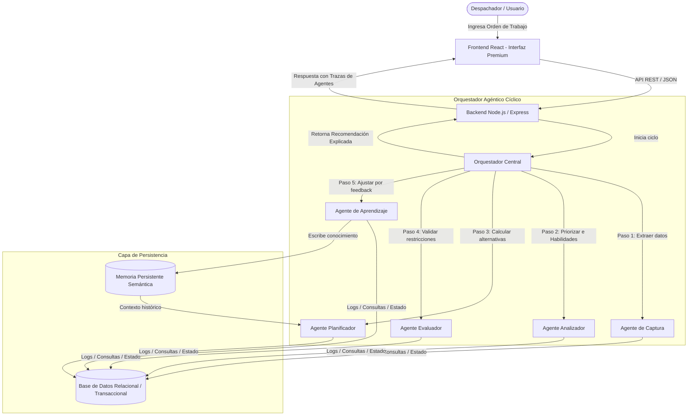

# Arquitectura del Sistema - Smart Dispatch IA

## Objetivo
Describir la estructura técnica, los componentes de software, el flujo de datos y la organización del sistema Smart Dispatch IA.

## Explicación de la Arquitectura
El sistema adopta una arquitectura desacoplada de tres capas con un módulo central de orquestación de agentes y una capa de persistencia híbrida.

## Componentes Principales

### 1. Frontend (React + Vite)
- Interfaz gráfica moderna de tipo single-page application (SPA).
- Permite la interacción del despachador con el sistema: creación de órdenes, configuración de simulaciones (activación de lluvias, tráfico pesado, etc.) y visualización del ciclo de agentes con animaciones y trazas en tiempo real.

### 2. Backend (Node.js + Express)
- Servidor REST API que provee endpoints de control de simulación y acceso a datos.
- Ejecuta el **Orquestador Central** que coordina la secuencia de llamadas de los agentes y consolida la recomendación final.

### 3. Motor Orquestador de Agentes
- Ejecuta de forma secuencial y estructurada las operaciones de los agentes.
- Pasa el estado acumulativo del ticket y la orden de trabajo de un agente a otro.

### 4. Capa de Memoria y Datos
- **Base de Datos Relacional (Simulada)**: Almacena la información de configuración operativa como los perfiles de los técnicos, sus horarios, ubicaciones y el histórico de órdenes de trabajo.
- **Memoria Persistente Semántica**: Colección estructurada de aprendizajes automáticos (ej. coeficientes de velocidad del técnico para ciertas tareas, preferencias del despachador, o patrones de ruteo). Es leída por el Agente Planificador al proponer asignaciones.

## Entradas y Salidas
- **Entrada Técnica**: Solicitud de orden (texto en lenguaje natural, geolocalización, urgencia) + Variables del Entorno (clima, tráfico, disponibilidad de técnicos).
- **Salida Técnica**: JSON estructurado que detalla el ID del técnico recomendado, hora sugerida de inicio, ruta sugerida, trazabilidad de aprobación de cada agente del ciclo y justificación textual.

## Checklist de Arquitectura
- [x] Diseñar diagrama de flujo general con Mermaid.
- [ ] Implementar la API REST en el backend.
- [ ] Desarrollar la conexión de datos y paso de contexto entre agentes.
- [ ] Asegurar persistencia de la memoria en archivos JSON locales dentro de `backend/data/`.
